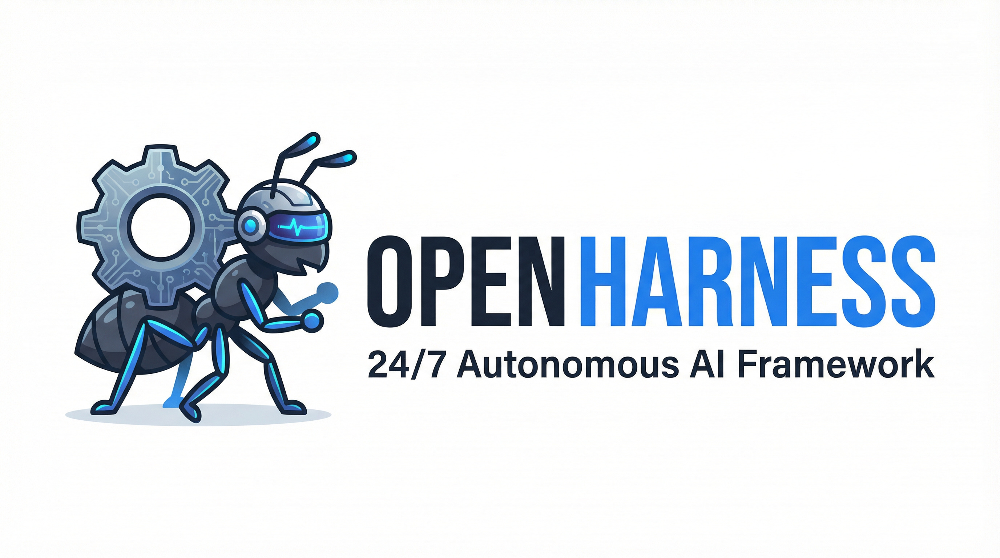

<p align="center">
  
</p>

<h1 align="center">⚙️ OpenHarness — The 24/7 Autonomous AI Framework</h1>

<p align="center"><b>We put a sturdy collar and plow on your AI, turning a wild horse into a tireless digital worker.</b></p>

<p align="center">
  
  
  
</p>

> **"Human attention is fleeting. AI does not need to sleep. But without strict constraints, AI hallucinates and loses its way. OpenHarness is the ultimate mechanical constraint."**

**OpenHarness** is a long-term, fully autonomous AI agent execution framework built on the hardcore principles of **Harness Engineering**. It enables your AI to work tirelessly for you 24/7 with just a single command. 

No more "AI chatting with AI and getting nowhere." We enforce strict state persistence, breakpoint recovery, and external validation mechanisms.

🎬 [Watch Demo]() · 🚀 [Quick Start](#-getting-started-one-sentence-trigger) · 🏛️ [Architecture](#%EF%B8%8F-the-six-pillars-of-harness-engineering) · 📦 [Installation](#-installation) · 📚 [Docs](references/architecture.md)

---

## 🤔 Why OpenHarness?

Most autonomous AI frameworks (like AutoGPT or BabyAGI) rely on the agent's "subjective judgment" to decide what to do next. The result? Infinite loops, context window explosions, and premature task completion.

OpenHarness takes a completely different approach: **Absolute Reliability over Emergent Intelligence.**

| Feature | AutoGPT | BabyAGI | OpenHarness ⚙️ |
|---|---|---|---|
| **Cross-Session Memory** | ❌ Loses context | ❌ Vector DB mess | ✅ `heartbeat.md` precise breakpoint recovery |
| **Completion Validation**| ❌ AI self-certifies | ❌ AI self-certifies | ✅ External `harness_eval.py` strict audit |
| **Execution Sandbox** | ❌ Unbounded | ❌ Unbounded | ✅ Strict `mission.md` contract constraints |
| **Entropy Control** | ❌ Context bloat | ❌ Context bloat | ✅ Built-in `harness_cleanup.py` garbage collection |
| **Trigger Mechanism** | Manual start | Manual start | ✅ 24/7 Cron scheduled, fully unattended |

**Core Difference: Mechanical Constraints + External Audit + 100% Traceability.**

---

## 📍 Positioning: The Core Engine

In the agent ecosystem, **OpenHarness** is a first-class citizen of the Workspace. It stands completely parallel to `skills` and `memory`.

```text
~/.openclaw/workspace/
  ├── harness/       <-- ⚙️ OpenHarness runs here (24/7 Scheduling & State Management)
  ├── memory/        <-- 🧠 Memory storage
  └── skills/        <-- 🛠️ Skill definitions
```

If `skills` defines *"what the agent can do"*, then `harness` defines *"how the agent can continuously and stably get things done without human intervention"*.

---

## 📦 Installation

To install OpenHarness into your OpenClaw environment, create the `harness` directory inside your OpenClaw workspace and clone this repository directly into it.

```bash
# 1. Create the harness directory
mkdir -p ~/.openclaw/workspace/harness

# 2. Clone OpenHarness into it
git clone https://github.com/thu-nmrc/OpenHarness.git ~/.openclaw/workspace/harness
```

Once installed, OpenClaw will automatically recognize the `SKILL.md` file and equip the agent with Harness capabilities. The `harness` directory sits at the same level as `skills` and `memory` — it is a core workspace component, not a plugin.

---

## 🚀 Getting Started: One-Sentence Trigger

**You only need to say one sentence.** The framework will automatically complete the rest. There is no need to manually create folders, write code, or edit configuration files.

### 🎯 How to Write a Prompt
To successfully trigger OpenHarness, your prompt should clearly state:
1. **The intent to use the framework**: Mention "use this harness project" or "use the harness framework".
2. **The core task**: What exactly the AI needs to do.
3. **The target/quantity**: The final expected output or completion condition.

### 💡 Killer Example Prompt

> *"Next, use this harness project to do 50 research reports related to the AI field separately, and finally summarize and organize them to give me a comprehensive AI field development report."*

### ⚡ What Happens Next?

Sit back and watch the magic happen. The agent will automatically:

1. 📂 Create the working directory at `~/.openclaw/workspace/harness/{task-slug}/`
2. 📝 Draft a strict `mission.md` (The unbreakable task contract)
3. 🗺️ Formulate a `playbook.md` (Step-by-step execution guide)
4. ⚖️ Define `eval_criteria.md` (Objective validation rules)
5. ⏱️ Configure `cron_config.md` (24/7 scheduling rules)
6. ❤️ Initialize `heartbeat.md` & `progress.md` (Cross-session memory)
7. 🚀 Set up the cron job and **immediately launch the first execution!**

---

## ⚙️ The Six Pillars of Harness Engineering

We mapped bureaucratic wisdom and modern software engineering into 6 indestructible components:

| Harness Component | Framework Implementation | How it Works |
|---|---|---|
| **1. Machine-Verifiable Contract** | `mission.md` + `eval_criteria.md` | Defines absolute, machine-checkable conditions for "what is considered done". No subjective BS. |
| **2. System of Record** | `playbook.md` + `progress.md` | Writes execution steps into versioned documents. The AI follows the playbook like a factory worker. |
| **3. Senses and Limbs** | Tool definitions in `playbook.md` | Grants the AI specific tools (e.g., browser, file I/O) required for each exact step. |
| **4. Solving Amnesia** | `heartbeat.md` + `progress.md` | The ultimate cross-session state recovery. If the agent dies, it wakes up and resumes from the exact line. |
| **5. External Validation** | `harness_eval.py` + `eval_criteria.md` | An independent validation script. The AI is never allowed to be its own referee. |
| **6. Entropy Control** | `harness_cleanup.py` + Boundaries | Periodically archives old records, compresses logs, and cleans temp files to prevent context window collapse. |

---

### 🔄 The Runtime Lifecycle

Every time the scheduled task is triggered (e.g., every hour), the agent executes this indestructible loop:

```text
┌─────────────────────────────────────────┐
│  1. harness_boot.py → Check state       │
│  2. harness_heartbeat.py start          │
│  3. Read mission / heartbeat / playbook │
│  4. Resume playbook steps from breakpoint│
│  5. harness_heartbeat.py done/fail      │
│  6. harness_eval.py → External validation│
│  7. harness_cleanup.py → Entropy control│
│  8. If all completed → mission_complete │
└─────────────────────────────────────────┘
```

---

## 🛠️ Framework Structure

```text
harness-24h/
├── SKILL.md                      ← 🧠 Agent skill entry point (triggered automatically)
├── scripts/
│   ├── harness_boot.py           ← 🥾 Bootstrapper: Initialization + state check
│   ├── harness_heartbeat.py      ← ❤️ Heartbeat: State read/write + progress tracking
│   ├── harness_eval.py           ← ⚖️ External validation: Independent quality check
│   ├── harness_cleanup.py        ← 🧹 Entropy control: Log compression + temp file cleanup
│   ├── harness_setup_cron.py     ← ⏱️ Scheduling config: Generate cron parameters
│   ├── harness_linter.py         ← 🏗️ Architecture linter: Constraint enforcement (Pillar 2)
│   └── memory_evolution.py       ← 🧬 Memory evolution: Trajectory learning engine (Pillar 3)
├── references/
│   ├── architecture.md           ← 🏛️ Architecture explanation (for the Agent to read)
│   └── anti-patterns.md          ← 🚫 Anti-patterns list (for the Agent to read)
└── templates/
    ├── mission.md                ← 📜 Task contract template
    ├── playbook.md               ← 🗺️ Execution playbook template
    ├── heartbeat.md              ← 💓 Heartbeat state template
    ├── progress.md               ← 📊 Progress log template
    ├── eval_criteria.md          ← 🔍 Validation criteria template
    └── cron_config.md            ← ⏰ Scheduling configuration template
```

---

## 🗺️ Roadmap: The Three Pillars of Harness Engineering

OpenHarness is rapidly evolving from a script-based scaffold into an industrial-grade orchestration platform. Our immediate roadmap is structured around the **Three Pillars of Harness Engineering**:

### 🛡️ Pillar 1: The Evaluation Loop (High Priority)
*We are upgrading `harness_eval.py` from basic file checks to a true End-to-End (E2E) Evaluation Engine.*
- [ ] **E2E Playwright Integration**: Introduce real browser-based verification (e.g., checking if an email was actually received or a dashboard was updated) rather than just checking if a JSON file exists.
- [ ] **Auto-Fix Generation**: When validation fails, the evaluator will automatically generate fix suggestions and inject them into `progress.md`, similar to Anthropic's CORE-Bench methodology.

### 🏛️ Pillar 2: Architecture Constraints
*We are moving from soft prompt-based constraints to hard mechanical constraints.*
- [ ] **Mechanical Linter (`harness_linter.py`)**: Enforce strict directional dependencies (e.g., UI cannot be touched before Service is ready) and automatically trim the tool whitelist to a maximum of 10 core tools to reduce context entropy.
- [ ] **CI/CD for Agents**: Run the linter automatically at every boot cycle to ensure the agent's generated playbook doesn't violate architectural boundaries.

### 🧬 Pillar 3: Memory Governance
*We are transforming static logs into an evolutionary knowledge base.*
- [ ] **Memory Evolution Engine (`memory_evolution.py`)**: When an execution scores high on the evaluation loop, the engine will extract the "success genes" (key insights, precise selectors, exact API parameters).
- [ ] **Auto-Updating Playbooks**: These extracted genes will be saved to a lightweight Vector DB and automatically injected back into `playbook.md`, allowing the agent to continuously evolve its own best practices.

### 🌀 Bonus: Entropy Combat
- [ ] **Git Auto-Commit & Rollback**: Integrate version control into the heartbeat. If the agent destroys the workspace, it can automatically roll back to the last known good state.
- [ ] **Self-Healing PRs**: Instead of humans fixing the agent, the agent writes PRs to fix its own tools when it encounters persistent blockers.

---

## 🤝 Community & Contribution

We welcome PRs to make the framework even more robust! Whether it is adding new validators, optimizing cleanup scripts, or improving documentation. Please refer to [CONTRIBUTING.md](CONTRIBUTING.md) for detailed guidelines.

## 📄 License

OpenHarness is released under the [Business Source License 1.1](LICENSE). **Free for academic, research, and non-commercial use.** Commercial use requires a separate license — contact [syycy2021@gmail.com](mailto:syycy2021@gmail.com).

## 👥 Contributors

| | Name | Role |
|---|---|---|
| 1 | [@thu-nmrc](https://github.com/thu-nmrc)  | Creator |
| 2 | [@shenlab-thu](https://github.com/shenlab-thu) | Contributor |
